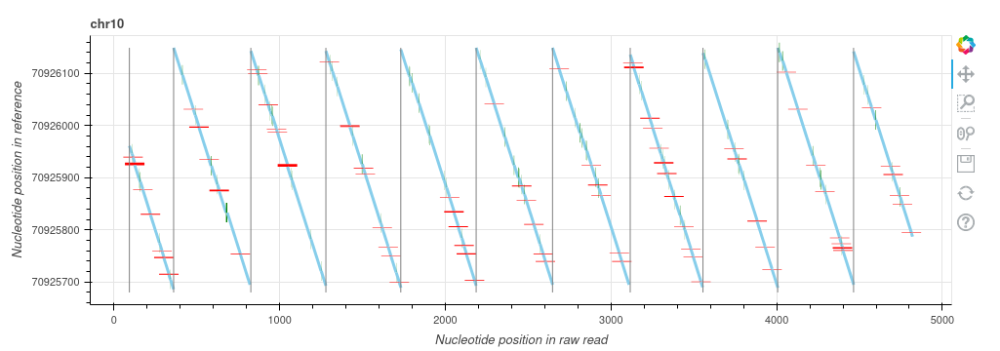
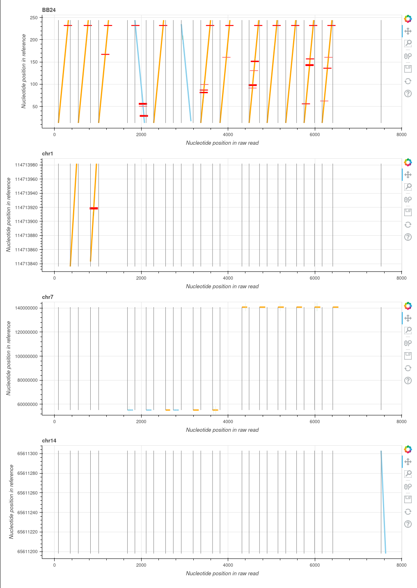

# 🌴 Cycas 🌴

CYclomics Consensus Alignment Sequences, or the interesting genus of the ["vredespalm"](https://en.wikipedia.org/wiki/Cycas) EN:(Peace palm).

Cycas uses the alignment against the reference genome to determine the type of read, and creates consensus sequences accordingly.


## Todo

- add unittests
- Remove pandas as dependancy (in piechart code)
- explore gap extention (inclusion of original fastq)
- explore superalignment (aka realignment of secondary alignments) (potentially fixed by better alignment)
- Add code to create piechart from multiple metadata jsons.

## Changelog

### 0.4.3
- Fix in type annotation

### 0.4.2
- Fix issue where 4th gen barcodes cause errors, please note that the barcode reported is incorrect for these in this update.
- Fix bug where extended cigar string was using a preset extender when applying insert locations.

### 0.4.1
- Fix for cases where value cannot be set on missing key.

### 0.4.0
- large overhaul of the codebase in general
- rewrote classifier
- changed metadata structure
- Changed consensus calling code to exclude unstarted and ended sequences.
- fixed bug where cigar strings where not parsed properly in some cases.

### 0.3.0
- Added subcommands `split`, `consensus`, and `single_read`.
- Renamed `Short*` to `LowAlignmentCount*`.
- Changed `TwoInsert` class to .
- Added `Singleton*` classification.
- Added Multimer Backbone classes
- Added `DirectionalFlip` for momomer, renamed old one to `DoubleDirectionalFlip`.
- Added `ComplexConcatemer`
- Pinned colors for each classification for beter comparison.


### 0.2.2
- Added Y tags as defined by cyclomics standards to fastq name line as well as metadata
- Changed warnings with regards to filtering
- Created Barcode extractor
- More general improvements

### 0.2.1

- Added metadata output json option (--create-metadata-json)
- Added classification details output (-create-classification-detail-json)
- Fixed bug with spaced inserts in chromosome

### 0.2.0

- Improved consensus calling
- Added filter at 3 repeats per alignment block
- Tweaked minimum deletion ratio

## Usage

All that is required is an alignment file of the raw Cyclomicseq data, which contains supplementary alignments.
example of usage is:

### Consensus

``` bash
python3 cycas/cycas.py consensus --bam-file <somepath>.bam --outfile <somepath>.fastq --metadata-json <somepath>.json 
```

### Single read

``` bash
python3 cycas/cycas.py single-read --bam-file <somepath>.bam --outfile <somepath>.fastq --read-name <some-read-name>
```

### Options

Options and their availability per subcommand:

|flag                                 |type  |Consensus |Single read |help |
|-------------------------------------|------|----------|------------|-----|
| --bam-file                          | PATH | X        | X          | Input BAM file, indexed. |
| --read-name                         | STR  |          | X          | name of the read as in the BAM file. |
| --output                            | PATH | X        | X          | Filepath for the output file in Fastq format.  |
| --plot-readtypes                    | BOOL | X        | X          | Plots 10 reads, usefulle for testing and classification development.   |
| --metadata-json                     | BOOL | X        | X          | Create a detailed output in json format about the classification  |
| --limit-calls                       | INT  | X        | X          | Limit the number of reads processed, usefull for testing.  |


## Design

First we obtain all alignments, derived from pysam AlignedSegments, called `Alignment` for a read in a `AlignmentGroup`. AlignmentGroups are also called groups.

Cycas uses Rules to determine the class of each read. The hierarchy is :

1. A `Rule`, or `ClassificationRule` is the atomic unit of this codebase. they have a score function that returns values between 0 and 1.
1. There is a `MetadataClassifier`, this group has multiple `Classifier`s it will apply, right now there is only one.
1. The `Classifier` with the lowest priority and that passes all requirements set by the `Rule`s will be reported, this also determines the consensus generation. 

## Classification definitions

1. SingleInsert

    Read where there is only one alignment against the species of origin.

    

1. SingleBackBone

    Read where there is only one alignment against a single backbone.

    

1. BackboneInsert

    A read where we map to the backbone and an insert in an alternating pattern. These reads are as the Cyclomicsseq protocol envisions them.

    

1. MessyAlignment

    Any read with more than 3 different directional chromosome alignments eg chr17+, chr17- BB22+ and chr2- 

    

1. Unkown

    Read that we where not able to classify.

    

## Colors

The main idea behind the piechart colors is that Blue is good, and orange is bad. The darker the hue of blue the better the read is. The darker the hue of orange, the worse the read is.

### old structure

35:U,
98:I:F:TP53:15160:97:0,
1:U,
248:BB:R:BB25:0:247:0,
134:I:F:TP53:15108:139:0,
5:U

bases_on_read:type:orient:assembly:position:mapping_length:ID
 
